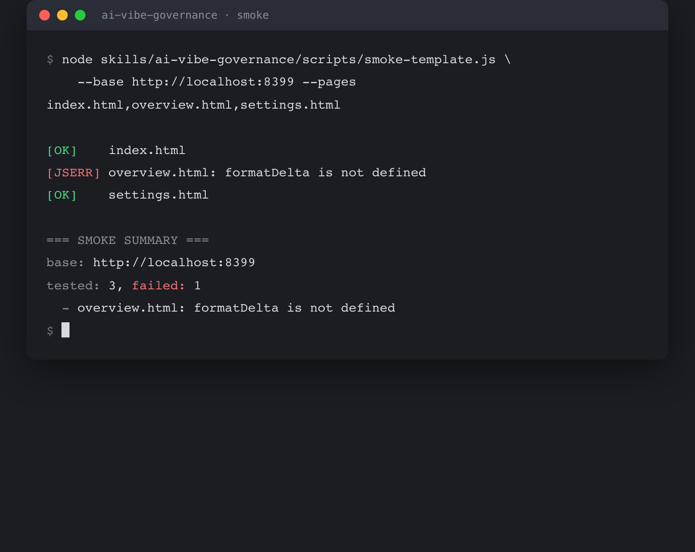
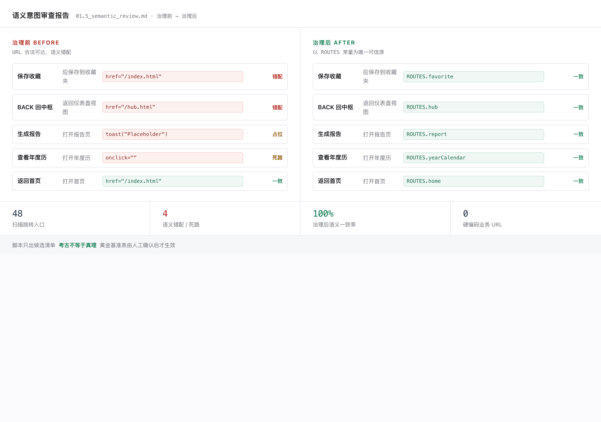

# AI-Vibe Site Governance Skills

> A skill toolkit for governing AI-vibe-coded websites
>
> **English** · [中文](README.md)

A methodology toolkit of agent skills for websites built by multi-round AI iteration. Four skills, three layers, one through-line:

> **Prove it runs, then prove it looks right, then prove it navigates correctly.**

## 30-second SOP

The division of labour is fixed: **the human only describes what feels wrong, and confirms priorities and plans**. Decomposition, localisation, analysis, fixing and regression are all the agent's job.

**1. Install it into your host tool**

```bash
git clone https://github.com/Frankryd/ai-vibe-site-governance-skills
```

Copy the `skills/` directory into your host tool's skill directory (see [Install](#install)).

**2. Configure a vision API (optional)**

Only needed if you want `visual-verify` to check screenshots. Any LLM API that accepts image input works, no vendor required:

```bash
export VISION_API_KEY="your-key-here"
```

**3. State the request and let it route itself**

You do not need to remember the four skill names. Just say "run a self-check on this site" and `site-check` routes by what you said:

| What you say | Routes to |
|---|---|
| "looks weird / wrong color / overlapping" | `visual-verify` — visual layer |
| "clicking does nothing / the result was lost / conclusions contradict" | `ai-vibe-governance` — behavior layer |
| "a button jumps to the wrong page / the label disagrees with the destination" | `route-governance` — routing layer |
| "give the whole site a health check" | behavior + visual, combined |

**4. Confirm in batches, regress every batch**

4-7 items per batch: propose the plan → **you confirm** (confirmation only, no technical knowledge needed) → fix → regress that batch plus a site-wide smoke test → only then move to the next batch. A smoke run looks like this:



`formatDelta is not defined` is a leftover function landmine the script actually caught, not demo data. Exit code `1` means there were failures.

## What it produces

The semantic-intent review from `route-governance`: same button, the URL is legal and reachable, but the semantics are wrong. Left is before governance, right is after switching to `ROUTES` constants.



**Archaeology is not truth.** The script only produces a candidate list. The golden baseline table must be human-confirmed before it takes effect.

## Core principles

1. **Standards-first** — build the criteria (red-line / polish grading) before scanning; no code changes until the standard exists
2. **Two-track verification** — functional (Playwright DOM assertions) and visual (screenshot + vision model) are separate, complementary, and never replace each other
3. **Batched confirmation** — each fix batch is: propose → human confirms → fix → independent regression → only then the next batch
4. **Responsibility boundary** — the human describes the feeling and confirms priority; the agent owns decomposition, localisation, analysis, fixing and regression

## The four skills

| Skill | Layer | Use case |
|---|---|---|
| `site-check` | Entry point | You only say "self-check / something feels off" without naming the layer → it auto-routes to the ones below |
| `ai-vibe-governance` | Behavior | Systematic audit and remediation (4 phases: audit → triage → batched fixes → regression) |
| `visual-verify` | Visual | Whether a single page or component "renders the way it should" |
| `route-governance` | Routing | Buttons jumping to the wrong page, labels disagreeing with destinations, hardcoded URLs |

## Install

```bash
git clone https://github.com/Frankryd/ai-vibe-site-governance-skills && cd ai-vibe-site-governance-skills
```

Place the `skills/` directory where your host tool expects it:

| Host | Location |
|---|---|
| OpenCode | `<project>/.opencode/skills/` |
| omp (managed-skills) | `~/.omp/agent/managed-skills/` |
| Anything else | anywhere the tool can read `SKILL.md` frontmatter |

`allowed-tools` in each skill's `SKILL.md` frontmatter uses paths **relative to the repository root**. If your host tool does not resolve relative paths, replace the prefix with the actual absolute path of your repository — this only affects the tool allowlist declaration; the scripts do not depend on it.

## Configuration

`visual-verify` needs any **vision-capable LLM API** (OpenAI-compatible `/chat/completions`, any vendor):

```bash
export VISION_API_KEY="your-key-here"
export VISION_BASE_URL=https://api.openai.com/v1   # optional, any compatible gateway
export VISION_MODEL=gpt-4o                          # optional, must accept image input
```

Or write them into `skills/visual-verify/scripts/.env` (the script has a built-in lightweight parser; environment variables take precedence). See `.env.example` for the template.

The smoke script in `ai-vibe-governance` needs Playwright: `npm i -D playwright`.

## Usage examples

```bash
# Site-wide smoke test (0 pageerror / 0 console.error)
node skills/ai-vibe-governance/scripts/smoke-template.js \
  --base http://localhost:3000 --pages index.html,about.html,pricing.html

# Visual inspection (screenshot → vision model)
node skills/visual-verify/scripts/analyze-image.js \
  audit/screenshots/dashboard-desktop.png \
  "Does the bar have 5 rows? Is the current month highlighted? Does mobile overflow?"
```

```bash
# Route archaeology scan (Phase 1, route A)
node /tmp/scan-routes.js <project root> [--out <output json path>]
```

`scan-routes.js` is embedded at the end of `skills/route-governance/SKILL.md` — copy it out to run.

## Layout

```
skills/
├─ site-check/SKILL.md (+ SKILL.en.md)
├─ ai-vibe-governance/
│  ├─ SKILL.md (+ SKILL.en.md)
│  ├─ reference/           # scan checklist, 6-dimension SOP, fix patterns, report template, workflow
│  └─ scripts/smoke-template.js
├─ visual-verify/
│  ├─ SKILL.md (+ SKILL.en.md)
│  └─ scripts/analyze-image.js
└─ route-governance/SKILL.md (+ SKILL.en.md)

docs/
├─ smoke-output.png       # README image: real smoke script output
└─ semantic-review.png    # README image: semantic-intent review report
```

## Language notes

The README ships in two versions, switch via the links at the top:

- `README.md` — Chinese (primary)
- `README.en.md` — English (this file)

Each skill also has **two files**:

- `SKILL.md` — **the Chinese file, which is the authoritative load entry point**. Tools read this one. Edit this one when updating the skill.
- `SKILL.en.md` — English, for English readers and wider sharing. Frontmatter matches the Chinese file (name / version / license / argument-hint / allowed-tools), and sections correspond one-to-one.

The bodies are maintained independently and are not synced automatically. Remember to update both when you change a skill, or the two languages will drift.

> The `scan-routes.js` script embedded in `route-governance` is **byte-identical** in both files (including its Chinese comments), because it is executable code — translating it would break it.

## Conventions (important)

- **No unilateral action** — every write/modify/delete is confirmed by the human first
- **No scope escalation** — a single-page visual issue does not get promoted to a full-site governance run, and vice versa
- **The golden baseline table for route governance is human-confirmed** — script output is only a snapshot of the current state, not the truth

## License

MIT. See [LICENSE](LICENSE).
